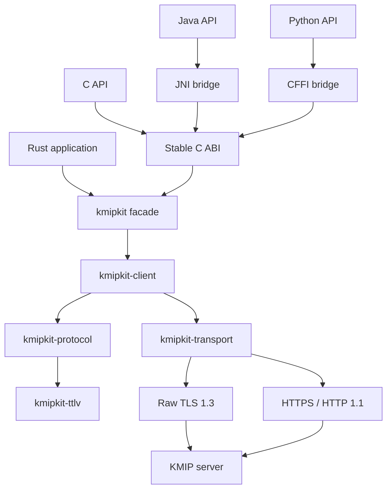

# Architecture overview

This document describes the target KMIPKit 1.0 architecture. Components and
responsibilities are planned unless explicitly marked **Implemented**; the
message flow below is also a target design, not evidence that each step exists
in the current code.

## System shape



One Rust implementation owns protocol semantics. Language adapters translate
idioms, resources, exceptions, and types; they do not reimplement KMIP.

## Workspace layout

```text
crates/
  kmipkit-ttlv/          Public generic tree and bounded decoder
  kmipkit-protocol/      KMIP models, validation, catalog output
  kmipkit-transport/     Public exchange contract; production adapters planned
  kmipkit-client/        Synchronous typed execution; no production constructor
  kmipkit/               Supported Rust facade and high-level API
  kmipkit-ffi/           C ABI; the only crate allowed to contain unsafe
  kmipkit-test-support/  Fakes, fixtures, and test PKI; not published
bindings/
  java/
  python/
specification/
  oasis/                  Immutable upstream sources
  catalog/                Reviewed machine-readable normative catalog
  compliance/             Requirement traceability and profile matrices
tools/
  specgen/                Deterministic source generation
  xtask/                  Repository automation
docs/
fuzz/
```

The planned 1.0 workspace targets five publishable runtime crates with
synchronized package versions. `kmipkit-ffi` is an additional, non-published
runtime crate; `kmipkit-test-support` is also non-published. The facade is
intended as the normal entry point; lower published crates are intended to
provide stable public APIs for advanced integration.

## Layer responsibilities

### `kmipkit-ttlv`

- Implemented: in-memory typed value model, catalog-checked tags, ordered generic tree, bounded Structure depth, and strict bounded decoder for one complete TTLV item.
- Planned: incremental framing primitives for transports.
- No public byte-producing encoder, KMIP operation semantics, or I/O.

### `kmipkit-protocol`

- Generated KMIP constants and known values.
- Managed objects, attributes, messages, and per-operation types.
- Structural and normative validation.
- Profile validation when explicitly requested.
- Conversion to and from generic TTLV.
- Unknown extension preservation.

### `kmipkit-transport`

- Implemented: public bounded synchronous byte-exchange contract, delivery-state errors, and zeroizing response wrapper.
- Not implemented: production raw TLS or HTTPS adapters.
- No KMIP operation-specific decisions.

### `kmipkit-client`

- Implemented: synchronous execution for explicit typed Discover Versions batches through the private writer and test fake.
- Implemented: one-exchange Poll, Cancel, Process, and Query Asynchronous Requests methods with operation-specific response validation, bounded decoding, delivery-state evidence, and redacted errors.
- No production Client constructor or live network backend. Discovery remains explicit; retries, follow-up polling, failover, and background waits are never automatic.

### `kmipkit`

- High level builders for every client operation.
- Public configuration, result, error, and secret types.
- Reexports of supported advanced protocol and TTLV APIs.
- Stable user-facing Rust documentation.

### `kmipkit-ffi`

- Panic containment.
- Opaque handles and fixed width ABI types.
- Thread-local detailed last error plus stable error codes.
- Memory and lifecycle functions.
- Generated operation builders and accessors.

## Message flow

1. The caller explicitly prepares a typed Discover Versions batch or calls one
   Poll, Cancel, Process, or Query Asynchronous Requests method.
2. The client validates request options and builds one bounded TTLV message.
3. The private writer encodes the typed operation; callers cannot replace it
   with generic Items, raw message bytes, or caller-defined conversions.
4. KMIPKIT-0007 passes the bounded request through the transport contract to a
   deterministic fake. No production TLS/HTTPS adapter or live-server path is
   currently available.
5. The client applies the configured response-byte cap, decodes TTLV with the
   same CodecLimits, and validates protocol, operation, and response relationships.
6. The call returns a typed operation outcome or Pending state. The caller may
   explicitly act again; the client does not retry, fail over, poll, or wait.

## Dependency rules

- Dependencies point downward through the layers shown above.
- TTLV cannot depend on protocol or transport.
- Protocol cannot perform network I/O.
- Transport cannot depend on high level operations.
- Bindings cannot contain KMIP business rules.
- Test support cannot become a runtime dependency.
- Vendor extensions cannot access transport internals.

## Future server-initiated operations

The codec and transport model direction and role explicitly. Version 1.0 only
executes client initiated requests. Version 1.1 adds listeners, dispatch, and
handlers without changing the core TTLV model.
