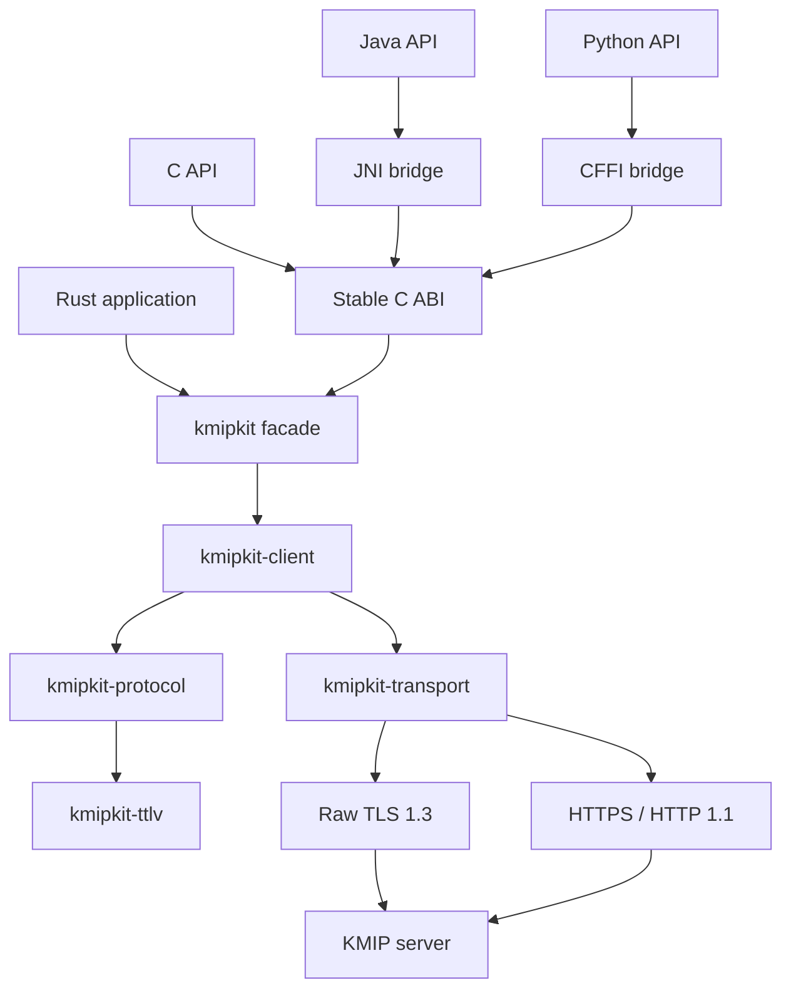

# Architecture overview

This document describes the target KMIPKit 1.0 architecture. Components and
responsibilities are planned unless explicitly marked **Implemented**; the
message flow below is also a target design, not evidence that each step exists
in the current code.

## System shape



One Rust implementation owns protocol semantics. Language adapters translate
idioms, resources, exceptions, and types; they do not reimplement KMIP.

## Workspace layout

```text
crates/
  kmipkit-ttlv/          Public generic tree and bounded decoder
  kmipkit-protocol/      KMIP models, validation, catalog output
  kmipkit-transport/     Raw TLS and HTTPS transport implementations
  kmipkit-client/        Synchronous orchestration, lifecycle, private uncalled writer
  kmipkit/               Supported Rust facade and high-level API
  kmipkit-ffi/           C ABI; the only crate allowed to contain unsafe
  kmipkit-test-support/  Fakes, fixtures, and test PKI; not published
bindings/
  java/
  python/
specification/
  oasis/                  Immutable upstream sources
  catalog/                Reviewed machine-readable normative catalog
  compliance/             Requirement traceability and profile matrices
tools/
  specgen/                Deterministic source generation
  xtask/                  Repository automation
docs/
fuzz/
```

The planned 1.0 workspace targets five publishable runtime crates with
synchronized package versions. `kmipkit-ffi` is an additional, non-published
runtime crate; `kmipkit-test-support` is also non-published. The facade is
intended as the normal entry point; lower published crates are intended to
provide stable public APIs for advanced integration.

## Layer responsibilities

### `kmipkit-ttlv`

- Implemented: in-memory typed value model, catalog-checked tags, ordered generic tree, bounded Structure depth, and strict bounded decoder for one complete TTLV item.
- Planned: incremental framing primitives for transports.
- No public byte-producing encoder, KMIP operation semantics, or I/O.

### `kmipkit-protocol`

- Generated KMIP constants and known values.
- Managed objects, attributes, messages, and per-operation types.
- Structural and normative validation.
- Profile validation when explicitly requested.
- Conversion to and from generic TTLV.
- Unknown extension preservation.

### `kmipkit-transport`

- Synchronous message transport trait.
- `TcpStream + rustls` raw TLS.
- `reqwest::blocking + rustls` HTTPS.
- Timeouts, delivery state, connection invalidation, and redacted events.
- No operation-specific decisions.

### `kmipkit-client`

- Client lifecycle and one reusable serialized connection.
- Request header construction and response correlation.
- Implemented: private outbound TTLV writer and zeroizing owner, with unit-test-only callers and no production callsite. The first client feature/spec owns the execute-owned permit and sole production callsite; its candidate PR must include the owner-through-transport integration test, and CI must pass it before merge, enablement, or release. Until then, the release branch must contain no production callsite or secret-bearing send. Execute must accept only closed typed requests, not generic Items/raw bodies/caller-implemented conversion traits; no general-purpose or public encoder.
- Batch execution and per-item outcomes.
- Pending operation handles and explicit polling/cancellation.
- No automatic retry, failover, or capability discovery.

### `kmipkit`

- High level builders for every client operation.
- Public configuration, result, error, and secret types.
- Reexports of supported advanced protocol and TTLV APIs.
- Stable user-facing Rust documentation.

### `kmipkit-ffi`

- Panic containment.
- Opaque handles and fixed width ABI types.
- Thread-local detailed last error plus stable error codes.
- Memory and lifecycle functions.
- Generated operation builders and accessors.

## Message flow

1. A high level builder creates a typed request.
2. Protocol validation applies invariant rules and any explicitly selected
   profile.
3. The request converts to generic TTLV; under accepted ADR-0012, a future production callsite to the implemented private writer requires an internal permit minted only by `Client::execute`, and execute receives only a closed typed request variant. KMIPKIT-0005 has no production callsite; the first client feature/spec owns the execute API, permit, sole writer callsite/mint site, and exact-one audit. No public `encode(&Item)` API, raw-body input, or caller-implementable conversion route is authorized. The first-client feature PR must contain both the sole production callsite and its owner-through-transport integration test. CI must run and pass that test against the candidate callsite before merge, enablement, or release; until then, the release branch must contain no production callsite or secret-bearing send.
4. The selected transport sends one complete bounded message.
5. The decoder validates TTLV before typed conversion.
6. The client validates version, correlation, batch count, and operation
   relationships.
7. A single operation returns a typed result, pending handle, or detailed KMIP
   error. A batch returns all per-item outcomes.

## Dependency rules

- Dependencies point downward through the layers shown above.
- TTLV cannot depend on protocol or transport.
- Protocol cannot perform network I/O.
- Transport cannot depend on high level operations.
- Bindings cannot contain KMIP business rules.
- Test support cannot become a runtime dependency.
- Vendor extensions cannot access transport internals.

## Future server-initiated operations

The codec and transport model direction and role explicitly. Version 1.0 only
executes client initiated requests. Version 1.1 adds listeners, dispatch, and
handlers without changing the core TTLV model.
