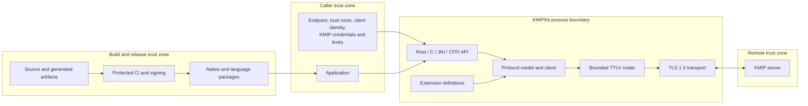

# KMIPKit threat model

Status: implementation snapshot and design baseline
Scope: KMIPKit 1.0 architecture, including KMIPKIT-0005 TTLV and KMIPKIT-0007 client execution
Last reviewed: 2026-10-06

This document models risks for the KMIPKit 1.0 architecture and distinguishes
current executable controls from planned components. The repository includes
the kmipkit-ttlv in-memory value model and public bounded decoder, the typed
KMIPKIT-0007 execution path, and the public low-level exchange contract. The
client supports explicit Discover Versions execution through a deterministic
test fake but has no production constructor or live TLS/HTTPS backend.
Additional protocol operations, production transports, FFI, and language
bindings remain design scope unless their source and tests establish
otherwise. Scenarios below remain hypotheses and security requirements unless
a control is explicitly tied to executable evidence. The model must be
revised as each executable boundary is introduced.
Independent architecture mapping and a source-level security diff review were
completed for KMIPKIT-0005 on 2026-10-05. A qualified human security review
remains a release requirement before 1.0.

## 1. Overview

KMIPKit is a client library that accepts application requests through Rust,
C, Java, or Python APIs, converts them into KMIP 2.1 TTLV messages, and sends
them to a configured KMIP server through raw TLS or HTTPS. One Rust core owns
the wire model and protocol behavior; the C ABI and language adapters translate
types and lifecycle conventions without reimplementing KMIP
([architecture](../architecture/overview.md#system-shape)).

### Components and evidence

The generic TTLV value model, bounded public decoder, typed client execution
foundation, and low-level transport contract are implemented. KMIPKIT-0007
provides a test fake but no production Client constructor or live TLS/HTTPS
backend. Other product component rows describe target design unless marked
implemented; CI validation is implemented while package publication remains
planned.
| Component | Responsibility | Security relevance | Evidence |
|---|---|---|---|
| Generic TTLV value model (implemented) | Construct and inspect typed in-memory values; preserve ordered Structures; check tag allocation and depth | Payload redaction and zeroization, bounded nesting, tag allocation; this model does not establish wire validity | `crates/kmipkit-ttlv/src/lib.rs:1-11`; `docs/architecture/public-api.md:34-49` |
| Public TTLV decoder (implemented) | Decode one bounded untrusted item into the public generic tree | Memory and CPU bounds, malformed-input rejection, unknown value preservation, no raw-byte retention | `crates/kmipkit-ttlv/src/codec/decoder.rs:29-162`; `crates/kmipkit-ttlv/src/codec/mod.rs:18-24,181-209` |
| Private client outbound writer (implemented; 0007 execute callsite) | Encodes only the closed typed request set through Client::execute; no general-purpose or public encoder | Execute-owned permit, one writer callsite, request owner through synchronous exchange, zeroization on drop, redacted diagnostics; this slice has no secret-bearing request operation | crates/kmipkit-client/src/wire_encoder.rs; crates/kmipkit-client/src/execute.rs; ADR-0012; specs/007-client-execution |
| Protocol and client | Validate requests and correlate responses | Prevent semantic confusion, wrong-result delivery, and implicit retry | docs/architecture/overview.md |
| Raw TLS and HTTPS transports (planned; not implemented) | Authenticate peers and carry messages | Server identity, client identity, confidentiality, framing, delivery state | docs/architecture/transport-security.md |
| C ABI | Expose native functionality to foreign runtimes | Pointer validity, ownership, panic containment, stable layouts | `docs/architecture/ffi-and-bindings.md:3-33` |
| Java and Python adapters | Offer idiomatic APIs and load native code | Native package integrity, secret copies, lifecycle and concurrency | `docs/architecture/ffi-and-bindings.md:46-81` |
| Extension registry | Interpret optional vendor data | Untrusted schemas, semantic ambiguity, denial of service | `docs/architecture/extensions.md:18-59` |
| CI validation and release publication | Run repository checks; build and publish packages | Generated-source integrity, dependency and artifact substitution, signing authority | CI checks: `.github/workflows/ci.yml`; publication design: `docs/development/git-and-releases.md:44-64` |

### Effective resources and capabilities

| Deployment or workflow | Resource or capability | Configuration and precedence | Safe effective value or location | Readers, writers, or recipients | Enforcing control | Evidence or unknowns |
|---|---|---|---|---|---|---|
| KMIP connection | Server endpoint and HTTPS path | Immutable client configuration; request cannot silently replace it | One explicit endpoint; `/kmip` is only the default HTTPS path | Caller, transport, configured server | URL validation, HTTPS-only policy, no redirects, no automatic alternative endpoint | Designed in `docs/architecture/transport-security.md:14-21,45-52`; implementation pending |
| TLS authentication | Trust roots, server name, client certificate, private key, CRLs | Explicit caller values; platform trust only by explicit selection | Caller-provided memory or file reference; secrets must not enter logs | Caller and rustls transport | TLS 1.3, chain/validity/name verification, mTLS, no insecure switch | Designed in `docs/architecture/transport-security.md:23-43`; secure file permissions remain a caller duty |
| KMIP authentication | Message credentials, OTPs, and tickets | Client defaults may be replaced per request or batch | No secret-bearing operation in KMIPKIT-0007; later typed operations must use explicit secret types | Caller, test-only typed execution path, authenticated KMIP server after approved transport exists | Redaction and initialized-byte zeroization are implemented for the typed execution lifecycle; a future secret-bearing operation requires its own owner-through-transport test before enablement | KMIPKIT-0007 uses Discover Versions only; foreign-runtime copies and external transport copies remain outside current evidence |
| Native bindings | Rust-owned handles and result buffers | ABI version and structure size are checked at entry | Opaque handles; matching KMIPKit release functions own deallocation | C, JNI, CFFI callers | Fixed-width ABI, explicit lengths, panic containment, dedicated free functions | Designed in `docs/architecture/ffi-and-bindings.md:3-24`; implementation and sanitizer evidence pending |
| Native package loading | Platform binary bundled with Java or Python package | Bundled binary first; explicit administrator path may override | Package-adjacent binary or private atomic extraction directory | Language runtime and current user | Package hash verification and ABI check; no runtime download | Designed in `docs/architecture/ffi-and-bindings.md:73-81`; exact extraction permissions and anti-swap procedure remain to be specified |
| Vendor extensions | Data-only definitions in an immutable client registry | Explicit registration during client construction | Parsed, size-bounded in-memory schema | Caller, core validator, KMIP peer | Duplicate rejection, deterministic registration, core invariants cannot be disabled | Designed in `docs/architecture/extensions.md:18-59`; manifest format and complexity limits remain to be specified |
| Release publication | Package registry and signing authority | Protected tag and CI workflow only | Short-lived publishing identities, signed artifacts, hashes, SBOM and provenance | Maintainers, CI, package registries, users | Protected review, pinned actions, trusted publishing | Designed in `docs/development/git-and-releases.md:44-64`; concrete workflows do not exist yet |

## 2. Threat model, trust boundaries, and assumptions

### Protected assets

- Private and symmetric key material transported in KMIP objects.
- TLS client private keys and KMIP message credentials.
- Server authenticity and the binding between a response and its request.
- Integrity and confidentiality of KMIP messages in transit.
- Availability of the caller process when parsing hostile network input.
- Native memory safety and allocator ownership across the C ABI.
- Integrity of generated protocol definitions and distributed native binaries.
- Accurate conformance, security, FIPS, and interoperability claims.

### Actors and realistic capabilities

| Actor | Starting capabilities | Capabilities not assumed |
|---|---|---|
| Network attacker | Observe, delay, drop, replay, fragment, or replace traffic; present an untrusted certificate | A trusted CA, the configured client private key, or control of the caller process |
| Malicious or compromised KMIP server | Send arbitrary bytes after a successful authenticated connection; return inconsistent batches, extensions, pending states, and large messages | Direct native memory access or authority to change local configuration |
| Untrusted application input | Influence KMIP operation fields or generic TTLV passed by an application | Permission to bypass the application's own authorization policy |
| Faulty or hostile foreign caller | Pass invalid pointers, lengths, handles, call order, or concurrent calls into the C ABI | A guarantee that arbitrary invalid addresses can be safely dereferenced; C caller memory safety remains a shared boundary |
| Malicious extension author | Supply complex or conflicting declarative definitions when the application registers them | Code execution through a declarative manifest or access to TLS internals |
| Supply-chain attacker | Publish a dependency or package with a confusing name, tamper with an unprotected workflow, or substitute a native artifact | Protected repository administration or release credentials by default |
| Local same-user attacker | Race or replace files in locations writable by the same OS identity | Privilege isolation from the application when both run as the same user |

### Intended trust boundaries and invariants

The controls below are design requirements, not claims that each component is
implemented. Current executable evidence is listed under Components and
evidence.

1. **Application to public API.** All sizes, enum values, identifiers, paths,
   endpoints, and generic TTLV are validated before use. High-level APIs do not
   silently choose cryptographic policy.
2. **Foreign runtime to C ABI.** Every entry validates handles, pointer/length
   pairs, structure versions, and lifecycle state before touching memory. No
   panic crosses the boundary and no allocator ownership is ambiguous
   (`docs/architecture/ffi-and-bindings.md:3-24`).
3. **Network to decoder.** Framing and resource limits are checked before
   allocation with overflow-safe arithmetic. Malformed frames invalidate the
   connection (`docs/architecture/transport-security.md:5-12,67-78`).
4. **Transport to remote identity.** The server certificate chain, validity,
   and name are mandatory; mTLS credentials identify the client. Redirects,
   proxies, 0-RTT, and automatic endpoint selection cannot change the peer
   (`docs/architecture/transport-security.md:14-43,45-52`).
5. **Response to request.** Protocol version, correlation, batch count,
   operation, and pending state are validated before delivering a result
   (`docs/architecture/overview.md:119-122`).
6. **Secret to diagnostics.** Keys, credentials, OTPs, tickets, private keys,
   raw bodies, and secret parameters never enter logs, errors, snapshots, or
   fixtures (`docs/architecture/transport-security.md:80-92`).
7. **Extension to core.** Extension interpretation cannot disable framing,
   limits, criticality handling, redaction, or transport policy
   (`docs/architecture/extensions.md:52-59`).
8. **Source to release.** Generated artifacts are reproducible from reviewed
   inputs, third-party sources and licenses are controlled, and publication
   occurs only from protected CI (`docs/development/git-and-releases.md:44-64`).

### Assumptions and caller obligations

- The application authorizes who may request KMIP operations. KMIPKit does not
  implement business authorization above KMIP.
- The caller protects certificate, private-key, credential, and output files
  with appropriate operating-system permissions.
- A process with the same privileges as the application can generally inspect
  its memory; zeroization reduces residual copies but does not create process
  isolation.
- Java and Python may create runtime-managed secret copies that native
  zeroization cannot guarantee to erase.
- The configured CA and server name are trustworthy. An explicitly selected
  platform trust store accepts its normal trust policy.
- No FIPS, formal certification, or independent audit claim exists without
  release-specific evidence (`SECURITY.md:49-53`).
- Dynamic executable extension plugins, local cryptographic algorithms,
  server-initiated operations, and automatic failover are outside the 1.0
  runtime boundary.

### Open design questions that must be resolved before implementation

- Exact declarative extension manifest grammar, byte/depth/count limits, and
  validation complexity budget.
- Java native extraction directory permissions, file locking, atomic publish,
  cleanup, and resistance to same-user replacement.
- Supported private-key file formats, encrypted-key handling, passphrase
  lifetime, and file-symlink policy.
- The exact status-code taxonomy for invalid foreign pointers versus invalid
  handles without attempting unsafe pointer recovery.
- Release signing technology, protected-environment rules, artifact retention,
  and key-compromise recovery.

## 3. Attack surface, mitigations, and attacker stories

Every row is a hypothesis for design and testing. It is not a finding until the
relevant implementation exists and evidence demonstrates the behavior.

| Priority | Scenario and capability gain | Prerequisites | Impact | Existing designed controls | Required mitigation and verification | Evidence |
|---|---|---|---|---|---|---|
| High | A malicious server declares extreme or overflowing TTLV lengths to obtain excessive allocation, CPU exhaustion, or memory corruption | Authenticated or network-reachable server can send a response | Caller process crash, denial of service, or potentially native code execution if unsafe parsing is introduced | Header-first framing, 16 MiB/depth 64/100,000 element defaults, overflow-safe checks, safe Rust codec | Keep codec safe Rust; limit before allocation; property tests, malformed vectors, fuzzing, Miri and sanitizers at native boundaries | `docs/architecture/transport-security.md:5-12,67-78`; `docs/development/testing.md:16-34,104-108` |
| High | A substituted CA, disabled name check, redirect, or proxy sends secrets to an attacker-controlled server | Caller uses unsafe configuration or transport silently follows a new destination | Disclosure of keys and credentials; unauthorized KMIP operations | No insecure switch, mandatory certificate checks, no redirects/proxies, one explicit endpoint | Make unsafe states unrepresentable; test unknown CA, mismatch, redirects, and alternate endpoints; redact configuration diagnostics | `docs/architecture/transport-security.md:14-43,45-52`; `docs/development/testing.md:42-46` |
| High | Invalid FFI lengths, stale handles, double free, or panic corrupts memory or unwinds into Java/Python/C | Foreign caller invokes ABI incorrectly or races lifecycle calls | Process compromise or crash | Opaque handles, explicit lengths, Rust-owned frees, panic containment, isolated unsafe crate | Define handle validation and concurrency state machine; compile C consumer; negative ABI tests; sanitizers; review every unsafe block | `docs/architecture/ffi-and-bindings.md:3-24`; `docs/development/testing.md:48-55` |
| High | A forged or mismatched KMIP response is returned to the wrong operation or batch item | Compromised server, stale connection bytes, or client correlation defect | Application uses the wrong key/object or misreports operation success | Version, correlation, batch, and operation checks; invalid connections discarded | Typed state-machine tests for duplicates, reordering, missing items, stale responses, and pending operations | `docs/architecture/overview.md:88-94,119-122` |
| High | A compromised build action, dependency, registry account, or generated catalog inserts malicious native code | Weak CI protections or publishing credentials | All downstream applications execute attacker code | Pinned actions, protected tags, CI-only publication, hashes, signatures, SBOM, provenance | Least-privilege jobs; trusted publishing; review generated diffs; dependency policy; reproducible release check; incident procedure | `docs/development/git-and-releases.md:44-64` |
| Medium | Request timeout after partial delivery causes an application to repeat a non-idempotent operation | Network interruption and caller retries without delivery context | Duplicate keys, state changes, or destructive operations | No automatic retry; delivery state distinguishes not sent, possibly sent, and response begun | Preserve delivery state through every binding; document reconciliation; test partial writes and timeouts | `docs/architecture/transport-security.md:45-65` |
| Medium | Secrets appear in errors, debug output, tracing, exceptions, test snapshots, or language runtime representations | Error path or convenience formatting handles a secret-bearing value | Credential or key disclosure to logs and telemetry | Specialized secret types, redaction policy, logging disabled by default | Deny `Debug`/serialization on secrets; redaction tests through every language; review panic and allocator diagnostics | `docs/architecture/transport-security.md:80-92`; `AGENTS.md:154-172` |
| Medium | A complex declarative extension consumes excessive CPU/memory or changes validation outcomes by registration order | Application loads an untrusted manifest | Denial of service or inconsistent protocol behavior | Immutable per-client registry, duplicate rejection, deterministic registration, core limits remain active | Define manifest limits and deterministic grammar; reject recursion/cycles; property test registration order; fuzz manifest parser | `docs/architecture/extensions.md:18-59` |
| Medium | A Java native binary is replaced between verification and loading | Attacker can write to extraction path under the same user or exploit non-atomic extraction | Native code execution in the application | Bundled hash verification, private location, atomic extraction, `System.load` | Specify restrictive permissions, collision-resistant path, create-new semantics, file handle strategy, and post-open identity check | `docs/architecture/ffi-and-bindings.md:73-81` |
| Medium | Unbounded or attacker-controlled file paths read unexpected certificates or keys | Caller passes a path derived from untrusted input | Credential disclosure or unintended identity use | Explicit configuration and no automatic discovery | Document caller authorization; reject non-files where needed; specify symlink policy; avoid including paths or contents in errors | `docs/architecture/transport-security.md:23-39` |
| Low | Detailed errors or timings expose object existence, server policy, or endpoint metadata | Application exposes library diagnostics to an untrusted party | Information disclosure that assists later attacks | Redacted structured events and caller-controlled logging | Classify public versus diagnostic errors; sanitize endpoint/query content; document that applications control audience | `docs/architecture/transport-security.md:87-92` |

## 4. Severity calibration

Severity describes the capability gained under realistic prerequisites. Lack of
implementation evidence lowers confidence, not impact.

### Critical

- Pre-authentication memory corruption in ordinary parser use that permits
  native code execution across supported clients.
- Release-signing or protected-publishing compromise that distributes malicious
  official packages broadly.
- Systematic unauthenticated extraction of private or symmetric key material
  from correctly configured clients.

A crash caused only by a caller already executing arbitrary native code in its
own process is not Critical because it grants no meaningful new authority.

### High

- Remote code execution or cross-boundary memory corruption requiring a
  successfully authenticated malicious KMIP server.
- TLS verification bypass that sends credentials or key material to an
  attacker-selected endpoint under normal secure configuration.
- Response-confusion flaws that cause an application to use the wrong secret or
  accept a failed sensitive operation as successful.

If exploitation requires the operator to install an attacker CA intentionally,
severity is reduced because that actor already grants server trust.

### Medium

- Reliable remote denial of service within documented message limits.
- Secret leakage into logs that requires access to application diagnostics.
- Native library substitution requiring write access to an otherwise protected
  same-user extraction directory.
- Duplicate non-idempotent operations caused by misleading delivery-state
  reporting.

### Low

- Bounded metadata exposure with no key or credential content.
- Local misuse that produces a clear error and affects only the invoking
  process.
- Documentation or hardening gaps without a demonstrated path to a protected
  asset.

The following alone are outside the security boundary: a fully privileged
application deliberately exporting its own secrets, an administrator
explicitly trusting a malicious CA, or a same-process native caller already
capable of arbitrary memory access. They may still justify safe defaults and
documentation but do not represent a new privilege gain by KMIPKit.
